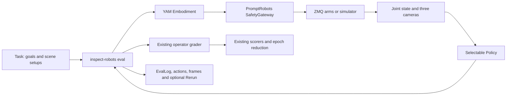

# Evaluate agents on the in-house YAM station

This pipeline uses the existing **inspect-robots** `Task`, `Scene`, `eval()`,
`Epochs`, operator grader, `operator_scorer()` and `episode_length()` APIs.
PromptRobots supplies the station configuration, cameras, robot transport,
kinematics and motion gateway. No framework core changes are required.



## Local environment

From `PromptRobots/`:

```bash
scripts/setup_inspect_yam.sh
scripts/run_inspect_yam.sh preflight --hardware
scripts/run_inspect_yam.sh smoke --epochs 2
```

Setup creates `.venv-inspect` with the existing `gello` environment's robot
dependencies and editable installations of the sibling `inspect-robots`
checkout and its `inspect-robots-agent` plugin. It does not modify `gello`.
Build dependencies are downloaded as needed. The local source revisions,
rather than PyPI releases, define the framework version for this setup.
Set `YAM_BASE_PYTHON` before setup to use another base environment;
`INSPECT_ROBOTS_ROOT` selects the framework checkout, and `YAM_EVAL_PYTHON`
overrides the launcher's Python.

`preflight` checks imports, kinematics, policy/embodiment compatibility,
configuration paths and key presence. It makes no API calls, opens no robot
or camera connections, and performs no motion. It does **not** establish
hardware connectivity. `smoke` uses scripted Responses calls, simulator
cameras and actual gateway planning; it exercises two gripper moves and a
stop through the real framework evaluator. Its metrics contain only episode
length, not task success.

## Station contract from PromptRobots

The source is [`configs/skild_yam_8.yaml`](../configs/skild_yam_8.yaml), together
with the existing YAM XML, URDF, camera configuration and gateway:

| Property | Station convention |
|---|---|
| Robot transport | gello ZMQ, `127.0.0.1:6001`, 14 values |
| Joint packing | left 6 joints, left gripper, right 6 joints, right gripper |
| Gripper polarity | 0 closed, 1 open |
| Cameras | `top_camera → top_cam`, `left_wrist_camera → left_cam`, `right_wrist_camera → right_cam` |
| Coordinates | Each arm's own base: +x forward, +y left, +z up |
| Base separation | Right base at left-frame y = −0.61 m |
| Tool position | Grasp site between fingertips, not the flange |
| Orientation | Relative to the measured pose at the start of each trial |
| Timing | Gateway waypoints at 10 Hz, interpolated control at 30 Hz, from station YAML |

Bounds, joint limits, speeds, IK, arm clearance, tracking limits and waypoint
budgets come from the existing gateway. The configured Cartesian bounding
box extends below the tabletop. Hardware runs therefore require the measured
floor through `--tool-floor-z` or `motion.tool_floor_z_m` in YAML. Do not
assume the table is at zero unless it has been measured in the arm-base frame.

Each hardware trial, including each epoch, prompts the operator to stage
the objects and starting arm pose. This adapter disables automatic homing
and does not move the robot when closing it. Start the existing YAM server
and make sure the station cameras are available before running an evaluation.

## Astra using the original PromptRobots policy

`prompt_astra` preserves PromptRobots' prompts, strict action-only tool
contract, image history and Responses client. `move_to` uses the existing
14 named dimensions; null dimensions retain the gateway's hold behavior,
including commanded gripper closure when holding an object.

```bash
# Real Astra, simulated arms. This is ungraded unless you choose operator grading.
scripts/run_inspect_yam.sh run --sim --grader none --fast-sim \
  --policy prompt_astra --model qwen/qwen3.8-max-0902 \
  --goal "Pick up blue and place on top of green block." --max-calls 10
```

For a scored hardware trial, use the setup and pass criteria in the existing
[spatial task guide](../tasks/spatial/README.md). Replace the floor variable
with your measurement:

```bash
export YAM_TOOL_FLOOR_Z_M='your_measured_table_height_in_metres'
scripts/run_inspect_yam.sh run --hardware \
  --policy prompt_astra --model qwen/qwen3.8-max-0902 \
  --goals-file tasks/spatial/goals_spatial.txt --scene-id SP01 \
  --pin-tilt --epochs 3 --max-calls 30 \
  --tool-floor-z "$YAM_TOOL_FLOOR_Z_M"
```

Remove `--scene-id SP01` to run all ten spatial scenes. The goal loader retains
SP01–SP10 IDs and setup comments. Other PromptRobots goal files work too;
stage the objects and apply the pass criteria from their task guides.

The API key uses PromptRobots' existing lookup. With the default `openrouter`
backend the `prompt_astra` policy calls `qwen/qwen3.8-max-0902` through OpenRouter's
Chat Completions API (tool calling, low reasoning effort); with `astra.backend: openai`
it uses the Responses API with `gpt-6-astra`, consistent with
[OpenAI's Astra guidance](https://developers.openai.com/api/docs/guides/latest-model).

## Replace Astra with other agents

For comparisons across models, use the **same `agent` policy** with a different
`-P model=provider/model`. This is the existing
[`inspect-robots-agent` plugin](../../inspect-robots/plugins/inspect-robots-agent/README.md),
including its native prompts, tools, provider routing and transcripts.

```bash
# Astra through the shared framework agent harness.
scripts/run_inspect_yam.sh run --hardware --policy agent \
  -P model=openai/gpt-6-astra -P wire=responses -P effort=low \
  --goals-file tasks/spatial/goals_spatial.txt --scene-id SP01 \
  --pin-tilt --epochs 3 --max-calls 30 \
  --tool-floor-z "$YAM_TOOL_FLOOR_Z_M"

# Another provider/model supported by your account; supply its environment key.
scripts/run_inspect_yam.sh run --hardware --policy agent \
  -P model="$EVAL_AGENT_MODEL" -P wire="$EVAL_AGENT_WIRE" \
  --goals-file tasks/spatial/goals_spatial.txt --scene-id SP01 \
  --pin-tilt --epochs 3 --max-calls 30 \
  --tool-floor-z "$YAM_TOOL_FLOOR_Z_M"
```

Provider keys and available wire formats follow the existing agent plugin.
The launcher defaults OpenAI agents to the Responses wire and low effort.
It supports `-P base_url=...`, `-P api_key_env=...`, and other factory options.

The framework agent supports `rot6d` rather than Euler rotation targets. Its
YAM view therefore exposes 20 values: for each arm, xyz, the first two
rotation-matrix columns, then gripper. The adapter orthonormalizes the columns
and converts them to the original gateway's yaw/pitch/roll convention. Invalid
or degenerate rotations cannot execute. Both views use the same physical
gateway; the original Astra policy retains its 14-dimensional interface.
`eef_targets` includes commanded gripper closure so that another agent does
not inadvertently relax an object by reusing a stalled measurement.

You can also select any installed registry policy, or your own factory:

```bash
scripts/run_inspect_yam.sh run --sim --grader none \
  --policy my_package.my_agent:create_policy --action-format rot6d \
  -P checkpoint=/path/to/checkpoint --goal "Move the left gripper forward."
```

A factory returns an inspect-robots `Policy` implementing `info`, `config`,
`reset(scene)` and `act(observation)`. It may implement `bind(embodiment_info)`
to adopt the spaces. `--action-format euler` is the default for custom policies;
use `rot6d` when needed. `eval()` rejects incompatible action spaces before
opening the robot. Stop actions use the framework's `request_stop` metadata.
Gateway feedback is available in `observation.extra["gateway_feedback"]` for
policies that consume it.

Switching from `prompt_astra` to `agent` changes the prompts and motion-tool
implementation as well as the interface. Treat that as a harness comparison.
For a model comparison, hold `--policy agent`, task setup, wire options where
applicable, budgets and station config fixed, and change the model.

## Scoring and artifacts

Hardware evaluation defaults to the built-in `operator` grader, which captures
the final judgement and notes. The built-in `operator_scorer()` reads that
judgement, while `episode_length()` counts framework actions. `Epochs` reduces
repeated scores by mean. Astra's `done` is a stop request, not a success oracle;
there is no automatic `success_at_end()` score for these real-world tasks.
`--grader none` records an ungraded run with episode length only.

Each framework step is one Cartesian target segment, potentially containing
many gateway waypoints. The generic agent may interpolate one model move into
several such actions. Compare LLM calls and latency separately from episode
length. The framework step cap and gateway waypoint cap use `max_waypoints`;
the selected built-in policy also enforces its LLM-call budget. Deadline checks
prevent further motion after expiry, including expiry during inference or
planning. They do not forcibly cancel an in-flight provider HTTP request.

Outputs default to `runs/inspect/`:

- Standard `EvalLog` JSON: model/policy identity, scene metadata, judgements,
  scores, repetitions, errors, transcripts and configuration provenance.
- Framework frame and action sidecars, enabled by default.
- `gateway/`: executed joint waypoints, measured final joints and rejection
  diagnostics for each completed target segment. These are gateway cadence
  waypoints; 30 Hz interpolated substeps are not individually recorded.
- `--rerun`: optional framework Rerun recording, requiring `rerun-sdk` in the
  evaluation environment.

Use the existing framework tools to inspect the result:

```bash
scripts/run_inspect_yam.sh inspect runs/inspect/LOG.json --transcript
scripts/run_inspect_yam.sh view runs/inspect/LOG.json
.venv-inspect/bin/python -m pytest tests/test_inspect_eval.py -q
```

The simulator is PromptRobots' lightweight kinematic world, not a calibrated
physics benchmark or an automatic reconstruction of each hardware task setup.
Simulator smoke results validate integration, not real-arm task performance.
