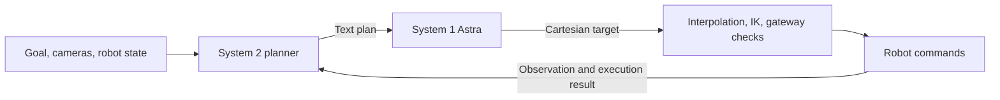

# Planning mode

Planning mode splits each robot decision between two models. System 2 handles understanding,
visual perception, task order, planning, recovery, and completion. It returns ordinary text and has
no robot tools. System 1 (Astra by default) receives the plan and measured robot state and predicts
one Cartesian end-effector target through `move_to`, or a session-control action. The existing gateway
interpolates the Cartesian target, runs IK and path checks, and streams joint commands to the robot.
Each executed motion is followed by a fresh observation, and a planning cycle covers one or more
motion turns (see [Pacing the loop](#pacing-the-loop)).



This uses the existing target-at-a-time control interface. Astra predicts the Cartesian target;
the gateway computes the dense joint-waypoint trajectory. It does not directly predict unchecked
joint commands or execute a long open-loop waypoint list. Bounds, collision checks, tracking checks,
operator stop, reactive scene checks, and the existing motion budgets still apply.

## Run

Set `--planning` in the example launcher to enable Qwen planning for the selected task
(use `--no-planning` for Astra alone):

```bash
python scripts/run_example.py
```

That launcher uses the real station and its existing `--yes` setting. For simulation with real model
inference, use:

```bash
scripts/run_astra_yam.sh run --config configs/skild_yam_8.yaml \
  --planning --planner-model qwen/qwen3.8-max-0902 --planner-effort high \
  --sim --goal "Stack the blue block on the green block."
```

The default planner needs `OPENROUTER_API_KEY`; Astra needs `OPENAI_API_KEY`. Key lookup is unchanged.
`--planner-model` also enables planning. `--model` and `--effort` configure the motion model;
the planner has its own model, effort, output-token limit, timeout, provider routing, and image window.
Use a planner endpoint that accepts camera images. A text-only endpoint cannot do the requested visual
perception without a separate perception source. Alternate model IDs can be supplied without code changes.

The equivalent YAML configuration is:

```yaml
astra:                         # System 1
  backend: openai
  model: gpt-6-astra
  actions_only: true
  reasoning_effort: low
  reasoning_summary: auto

planning:
  enabled: true
  planner:                     # System 2
    backend: openrouter
    model: qwen/qwen3.8-max-0902
    reasoning_effort: high
    reasoning_summary: auto
    image_history: 4
  motion_images: false
```

The planner's tools are always disabled, even if action-only or required-tool settings are accidentally
inherited in its configuration. Empty planner text or a planner tool call ends the trial before motion
inference. The motion model uses the existing action/language setting; `--language-output` allows action
notes, while `--actions-only` requires numeric actions without notes.

System 1 normally receives only text and proprioception. Set `planning.motion_images: true` to also send
it images for geometric grounding. System 2 still owns the high-level decisions.

`--max-calls 100` allows at most 50 planner/motion cycles at the default pacing. Both model attempts
count, including failures; a cycle that starts with a planner call requires two available calls, a
continuation turn one. Total token usage includes both models. Optional shadow models still compare the
motion decision; as in single-model mode, their extra calls are outside that budget.

## Pacing the loop

Profiling `runs/recycled/20260921_155454_fail` (10 cycles, 265 s): System 2 was 79% of the wall clock at
21 s per call, System 1 a further 15% at 4 s per call, and the arm was in motion for 12 s - a 4% duty
cycle. System 2's latency tracked its output tokens almost exactly (r = 0.99, a flat 37-41 tok/s) and was
independent of input size, so it is decode-bound, not context-bound. System 1's 4 s bought 90 output
tokens, so its cost is round trip, not generation. Three settings address that split.

**A whole stroke per call.** `motion.max_waypoints_per_call` above 1 replaces `move_to`'s single `targets`
object with a `waypoints` sequence. The legs run as consecutive straight Cartesian segments with no stop
between them, and the entire path is planned, IK-solved and safety-checked before anything moves - a
rejection names the leg that failed and nothing executes. Within a leg, unnamed dimensions hold the value
the *previous leg* left them at, so a stroke reads the way it is written. The per-leg detour search is
unchanged: one crowded leg can go over or around without disturbing the rest. Gateway rejections, the
waypoint budget, clearance and tracking checks all apply to the whole stroke.

**Several motion turns per plan.** `planning.motion_calls_per_plan` above 1 lets System 1 take that many
turns, each with a fresh observation, before System 2 is consulted again. A rejected action, a scene
change, or operator feedback recalls System 2 immediately regardless - the setting amortizes a plan that
is still holding, it does not make the robot act on a stale one. Continuation turns carry a
`session.plan_continuation` message saying which turn they are and what to do if the instruction is
already finished.

**System 1 dispatched early.** System 2 writes its instruction to System 1 *first*, fenced between
`NEXT INSTRUCTION` and `END INSTRUCTION`, and its scene assessment and progress notes after. Only the
fenced block crosses to System 1. With `planning.speculative_motion` on (the default), the harness sends
System 1's request the moment the closing fence arrives in the stream, so System 1's time-to-first-token
runs underneath System 2's remaining tokens instead of after them. The request is byte-identical to the
one the sequential path would send; the instruction is re-checked against System 2's completed message
before the response is used, and a mismatch discards the speculative answer and re-asks. A planner that
does not emit the fences is not penalized: its whole message is handed over and the cycle runs
sequentially. `transcript.txt` reports how many speculations were reused and how many seconds they hid.

**System 1 says nothing except why it stopped.** `planning.motion_actions_only` (default on) puts System 1
on the strict action-only contract whenever planning is enabled, overriding `astra.actions_only`. System 1
then has no `note`, `lesson`, `summary` or `hindsight` field, and the local protocol check rejects an
assistant message before anything is dispatched. `done` and `give_up` keep one required `reason`: they end
the trial, so the sentence costs nothing on the robot's critical path, and a terminal call with no reason
leaves the operator reconstructing the cause from the logs (see `runs/recycled/20260921_191247_fail`, where
System 1 quit with a bare `{}`). Strict mode also sets a *floor* of `reasoning.effort: low`, not a ceiling -
a configured `--effort` survives it. Scene assessment and progress reporting are System 2's job; System 1
repeating them in its own words cost roughly 60% of its output tokens on the robot's critical path and told
the operator nothing new. The plan text is written to `notes.md`, so the human-readable narration survives.
Pass `--language-output` (or set `planning.motion_actions_only: false`) to go back to System 1 notes.

Two things follow from System 1 being blind (`motion_images: false`) and, outside reactive mode, having no
`observe` tool. First, System 2 must write the instruction so a blind arm can execute it - directions and
distances relative to the arm's own measured pose and to the objects, never "visible in the right camera
view" or "verify from the overhead camera", which leave System 1 with nothing to act on. Second, System 1
must not treat "I cannot see it" as grounds to stop: that is the normal condition of the role, and a short
motion in the described direction is more informative to System 2 than a `give_up`. Both rules are in
`docs/PLANNER_PROMPT.md` and `docs/MOTION_PROMPT.md`; together with the missing reason field they are
what turned 20260921_191247_fail into a silent quit two cycles in.

Use `--no-planning` to restore the single-model loop. `show-prompt --planning --bundle-json` prints
both assembled prompts, the motion tools, and the planner's empty tool list. Role prompts live in
`docs/PLANNER_PROMPT.md` and `docs/MOTION_PROMPT.md`; their paths are configurable.
Planning mode is implemented in `utils run`; the separate Inspect adapter rejects it explicitly.

## Connected histories and logs

Each `run()` starts two fresh histories. Across all cycles of that run:

- System 2 retains its own native responses and returned reasoning items, plus observations, operator
  messages, labeled motion proposals, and actual execution/rejection results.
- System 1 retains its own native responses, reasoning items, tool results, and every text plan it received.
- Provider-specific encrypted reasoning stays in the producing model's history. The planner's final text
  is the handoff to Astra. Motion proposals and execution results return as reports to the planner.
- Only old camera images are removed from inference requests according to each model's image window.
  Text and returned reasoning history are retained. All camera frames remain on disk.

The trial folder contains:

| File | Contents |
| --- | --- |
| `transcript.txt` | Both prompts, observations, planner text, returned readable reasoning, motion actions, and gateway results |
| `transcript.jsonl` | Events linking planner and motion call indices to the same planning cycle |
| `requests/planner_NNNN.json` | System 2 request, with base64 images replaced by blob references |
| `responses/planner_NNNN.json` | System 2 output, reasoning, usage, response ID, raw provider response, or error |
| `requests/request_NNNN.json` | System 1 request, including the latest planner handoff |
| `responses/response_NNNN.json` | System 1 output, reasoning, usage, response ID, raw provider response, or error |
| `motion_NNNN.json` | Predicted Cartesian target(s), resolved targets per leg, IK joint path, execution result, and both call indices |
| `planner_history.json`, `motion_history.json` | Final conversations, including the last execution result |
| `frames/` | Original camera images |
| `summary.json` | Outcome, combined usage, total calls, separate planner/motion counts, and waypoint counts |

Call indices in filenames are zero-based across both models: planner 0000, motion 0001, planner 0002,
motion 0003, and so on. With `motion_calls_per_plan` above 1 a cycle owns several motion indices in a row;
each `motion_request` event carries `motion_in_cycle` and whether the call was dispatched speculatively,
and `speculative_motion` events record the seconds hidden. The human-readable transcript numbers calls starting at 1.
SDK transport retries are part of a logical model call, not separate planning cycles.

All outputs and reasoning made available by the provider are logged. Astra exposes readable reasoning
summaries and opaque encrypted reasoning for continuity; raw private reasoning tokens are not available
as readable logs. This follows the [OpenAI reasoning documentation](https://developers.openai.com/api/docs/guides/reasoning).

## Offline verification

```bash
python -m pytest -q tests/test_planning.py tests/test_pipelining.py
```

The tests use scripted model responses and the simulated robot with the real gateway/IK implementation.
Scripted planner files use entries such as `{"text": "Close the left gripper slightly.", "reasoning": "Optional test trace."}`;
motion scripts use the existing `{"name": "move_to", "arguments": ...}` format.
